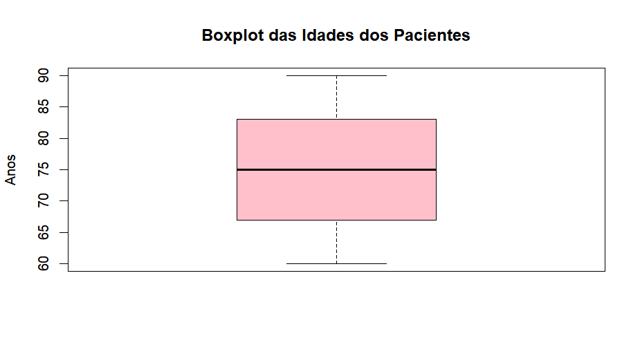
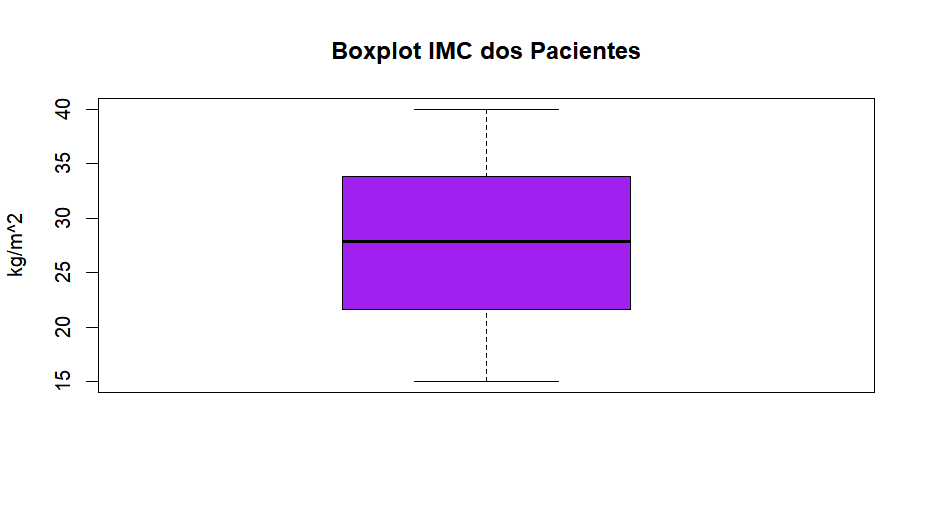
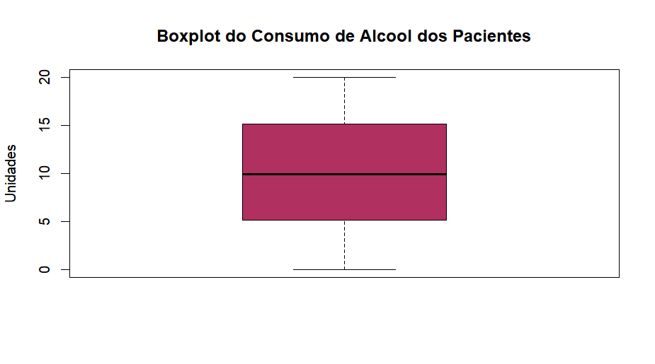
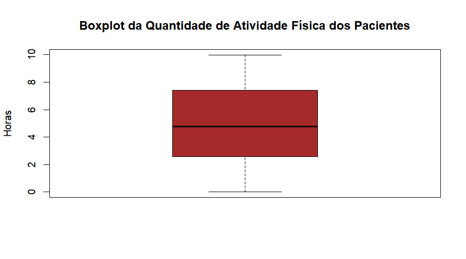
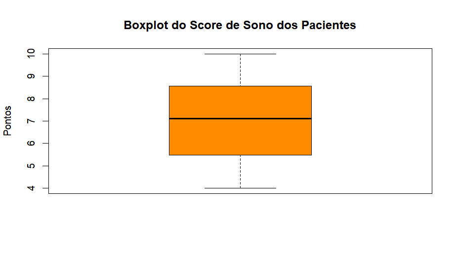

# Análise Descritiva do Banco de Dados

O banco é composto por dados de pacientes com e sem a doença de Alzheimer. A pesquisa aqui se objetifica a buscar compreender os fatores que podem aumentar o risco de desenvolvimento da doença. Para isso, começamos analisando descritivamente o banco de dados e suas variáveis de 1) idade, 2) gênero, 3) IMC, 4) consumo de álcool, 5) atividade física e 6)qualidade de sono.

## Idades

A começar pela **idade**, é possível ver na Figura 1, temos uma distribuição simétrica das idades dos pacientes, tendo sua mediana em 75 anos de idade, sem outliers e com menor variabilidade. Seu coeficiente de variação é de 12%, indicando baixa dispersão das idades dos pacientes.

{width="408"}

## Gênero

Como os dados a respeito de gênero são binários, utilizamos uma análise por Bernoulli para identificar qual era a proporção da dispersão. Tendo 1061 pacientes identificados como 0 - masculino e 1088 pacientes identificados como 1 - feminino. Concluímos, então, que a maioria dos pacientes é de mulheres, porém com pouca diferença representativa no total da população analisada.

| Resultados 0     | Resultados 1    |
|------------------|-----------------|
| 1061             | 1088            |
| Gênero masculino | Gênero feminino |

## IMC

A respeito do IMC, é possível observar o boxplot da Figura 2. Os dados apresentam pouca variabilidade e dispersão, sem conter outliers. Ao comparar a mediana e a média, observamos uma leve assimetria à esquerda. Ainda sobre a mediana, obteve-se um valor de 27,82 kg/m^2^, o que coloca a maioria dos pacientes em sobrepeso, com um coeficiente de variação de 26,1%, indicando dispersão moderada do IMC dos pacientes.

{width="429"}

## Consumo de álcool

Sobre o consumo de álcool, identificou-se o boxplot na Figura 3. Identificou-se, também, uma leve assimetria à direita já que a mediana é menor do que a média, um coeficiente de variação alto de 57,83%, representando alta dispersão na quantidade de álcool consumido pelos pacientes. A mediana do consumo de álcool dos pacientes é de 10 unidades semanais.

{width="431"}

## Atividade Física

A respeito da quantidade de atividade física pratica, a Figura 4 apresenta o boxplot da medida. O boxplot mostra que a amostra apresenta uma leve assimetria à direita, tendo mediana correspondente à 4,7 horas semanais de atividade física com coeficiente de variação de 57,35%, o que sugere grande dispersão na quantidade de exercício entre os pacientes.

{width="455"}

## Qualidade do Sono

Por fim, a respeito da qualidade de sono dos pacientes, é possível identificar na Figura 5 uma simetria no score de sono dos pacientes observados com mediana de 7 pontos de sono diário com coeficiente de variação de 25%, o que indica uma dispersão moderada nos pontos de sono dos pacientes.

{width="491"}

## **Diagnóstico**

Por fim, estudando o diagnóstico através da dispersão de Bernoulli podemos perceber uma maioria de pacientes diagnosticados com a Doença de Alzheimer, porém tendo pouca diferença na população total.

| Resultados 0                        | Resultados 1                        |
|-------------------------------------|-------------------------------------|
| 1061                                | 1088                                |
| Diagnóstico negativo para Alzheimer | Diagnóstico positivo para Alzheimer |
